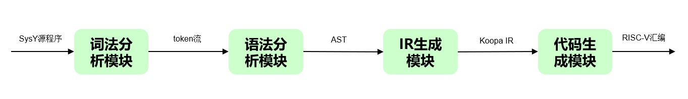

# SysY编译器设计与实现

## 0 基础背景

### 0.1 框架

**前端**: 通过**词法分析和语法分析**，将源代码解析成抽象语法树 (abstract syntax tree, **AST**)。 通过**语义分析**，扫描抽象语法树，解析抽象语法树的语义。
**中端**: **将抽象语法树转换为中间表示** (intermediate representation，IR)，并在此基础上完成一些机器无关优化。
**后端**: 将中间表示转换为目标平台的汇编代码，并在此基础上完成一些机器相关优化。

### 0.2 词法分析

词法分析的作用，是把字节流转换为单词流 (token stream)。词法分析器 (lexer) 会按照某种规则读取文件，并将文件的内容拆分成一个个 token 作为输出, 传递给语法分析器 (parser)。同时，lexer 还会忽略文件里的一些无意义的内容，比如空格，换行符和注释。

**Lexer 生成的 token 会包含一些信息**，用来让 parser 区分 token 的种类, 以及在必要时获取 token 的内容. 例如int main可能能被转换成如下的 token 流:
    
```cpp
int main() {
  
  return 0;
}
```
1.种类: 关键字, 内容: int.
2.种类: 标识符, 内容: main.
3.种类: 其他字符, 内容: (.
4.种类: 其他字符, 内容: ).
5.种类: 其他字符, 内容: {.
6.种类: 关键字, 内容: return.
7.种类: 整数字面量, 内容: 0.
8.种类: 其他字符, 内容: ;.
9.种类: 其他字符, 内容: }.

得到的终极符是这样的
```
"int" IDENT "(" ")" "{" "return" INT_CONST ";" "}"
```

### 0.3 语法分析

语法分析的目的是，按照**程序的语法规则**，例如，对于 SysY 程序，关键字 int 后跟的一定是一个标识符, 而不可能是一个整数字面量），**将输入的 token 流变成程序的 AST**

**Parser 会通过某些语法分析算法**，例如 LL 分析法或 LR 分析法，**对 token 流做一系列的分析, 并最终得到 AST**。

上述程序经分析后, 可能能得到如下的 AST:
``` cpp
CompUnit {
  items: [
    FuncDef {
      type: "int",
      name: "main",
      params: [],
      body: Block {
        stmts: [
          Return {
            value: 0
          }
        ]
      }
    }
  ]
}
```

### 0.4 语义分析

**语法分析的基础上，编译器会对 AST 做进一步的语义分析, 以期 “理解” 输入程序的语义**，为之后的 IR 生成做准备。

**语义分析阶段**，编译器通常会：

- **建立符号表**，跟踪程序里变量的声明和使用，**确定程序在某处用到了哪一个变量，同时也可发现变量重复定义/引用未定义变量之类的错误。**

- **进行类型检查**，确定程序中是否存在诸如 “对整数变量进行数组访问” 这种类型问题。同时标注程序中表达式的类型，以便进行后续的生成工作。对于某些编程语言（例如 C++11 之后的 C++、Rust 等等，编译器还会进行类型推断.

- **进行必要的编译期计算**，SysY 中支持使用常量表达式作为数组定义时的长度，而我们**在生成 IR 之前，必须知道数组的长度** (SysY 不支持 VLA)，这就要求编译器**必须能在编译的时候算出常量表达式的值**, 同时对那些无法计算的常量表达式报错。对于某些支持元编程的语言，这一步可能会非常复杂。

**至此, 我们就能得到一个语法正确, 语义清晰的 AST 表示了。**

### 0.5 中间代码（IR）生成
编译器通常不会直接通过扫描 AST 来生成目标代码 (汇编)，而是会先将 AST 转换为一种中间表示 (IR，intermediate representation)，**IR 的抽象层次比 AST 更低**，然后再将 IR 转换为目标代码。

如果我们先把所有源语言都转换到同一种 IR，然后再将这种 IR 翻译为不同的目标代码，我们就只需要开发 M种语言+N种指令系统相关模块。

例如 LLVM IR 就是一种被广泛使用的 IR。此时，编译器的前后端是完全解耦的, 两部分可以各自维护, 十分方便。
**我们使用的koopa IR也是一种和LLVM IR类似的中间表示，但相对有所简化。**
例如int main的Koopa IR大致如下所示：

```

decl @getint(): i32
decl @getch(): i32
decl @getarray(*i32): i32
decl @putint(i32)
decl @putch(i32)
decl @putarray(i32, *i32)
decl @starttime()
decl @stoptime()

fun @main(): i32 {
%entry:
  ret 0
}
```

### 0.6 目标代码生成

- **指令选择**: 决定 IR 中的指令应该被翻译为哪些目标指令系统的指令. 例如前文的 Koopa IR 程序中出现的 lt 指令可以被翻译为 RISC-V 中的 slt/slti 指令.（**我们只关注这个部分**）

- **寄存器分配**: 决定 IR 中的值和指令系统中寄存器的对应关系. 例如前文的 Koopa IR 程序中的 @x, %cond, %0 等等, 它们最终可能会被放在 RISC-V 的某些寄存器中. 由于指令系统中寄存器的数量通常是有限的 (RISC-V 中只有 32 个整数通用寄存器, 且它们并不都能用来存放数据), 某些值还可能会被分配在内存中.

- **指令调度**: 决定 IR 生成的指令序列最终的顺序如何. 我们通常希望编译器能生成一个最优化的指令序列, 它可以最大程度地利用目标平台的微结构特性, 这样生成的程序的性能就会很高. 例如编译器可能会穿插调度访存指令和其他指令, 以求减少访存导致的停顿.

**至此，编译器的大致结构已经说明完毕。**

## 1 编译器概述

### 1.1 基本功能

本编译器实现了从 SysY 语言（一种简化的 C 语言）到 RISC-V 汇编语言的转换。SysY 的设计旨在教学和研究编译原理中使用，而本编译器则将其转换为符合 RV32IM 指令集的 RISC-V 汇编。转换过程首先将 SysY 源代码转化为 Koopa IR，一种中间表示形式，然后再转换为目标 RISC-V 汇编代码。

要运行编译器，用户可以通过在命令行中使用特定的参数来生成不同的代码表示，如下所示：

```sh
make
build/compiler -koopa SysY文件路径 -o KoopaIR文件路径
build/compiler -riscv SysY文件路径 -o RISC-V文件路径
```

环境提供了运行中间代码的方式，如下所示：

```sh
koopac KoopaIR文件路径 | llc --filetype=obj -o o文件路径
clang o文件路径 -L$CDE_LIBRARY_PATH/native -lsysy -o 可执行文件路径
./hello
```

### 1.2 主要特点

- **双层中间表示策略**: 编译过程首先生成一个高级的抽象语法树，随后转换为更低层的 Koopa IR。这一分层方法确保了处理的灵活性和效率，抽象语法树主要用于捕捉和组织语法结构，而 Koopa IR 负责详细描述操作和控制流。

- **前后端低耦合**: 我们的编译器前端负责生成规范的 Koopa IR，后端则侧重于将此中间代码转化为汇编。两者之间的接口明确，互不干扰。

- **栈式符号表管理**: 编译过程中使用栈式符号表来管理变量和作用域，保证了名字解析的正确性和高效性。每当进入一个新的作用域，符号表就增加一层；每结束一个作用域，就将其弹出。

- **ScopeHelper 工具**: 为了更好地调试和理解编译器的行为，我们实现了一个名为 ScopeHelper 的工具，该工具通过利用构造函数和析构函数在控制台输出抽象语法树的结构，从而帮助开发者和学习者可视化理解程序结构。此工具在每个作用域的进入和退出时输出对应的缩进，清晰地展示了程序的嵌套层次。

此外，编译器的所有环境均运行于**中科方德操作系统**上，充分利用了其稳定和高效的系统环境来优化编译过程。需要注意的是，后端部分的实现基于现有的开源项目，我们主要集中在前端的开发和优化上，以保证 SysY 代码能被准确地转换为有效的中间表示。


---以上均为原创---

## 2 编译器设计

### 2.1 主要模块组成

编译器主要分成如下四大模块：

- **词法分析模块**: 通过词法分析，将SysY源程序转换为token流。(源代码中`sysy.l`)
- **语法分析模块**: 通过语法分析，得到`AST.h`中定义的抽象语法树。(源代码中`sysy.y`)
- **IR生成模块**: 遍历抽象语法树，进行语义分析，得到 Koopa IR 中间表示。(源代码中`AST.[h|cpp]`)
- **目标代码生成模块**: 扫描Koopa IR，将其转换为RISC-V代码。(源代码中`visit.[h|cpp]`)

模块之间的数据流图如下。



我们使用 Flex 和 Bison 来分别生成词法分析器和语法分析器. 其中:

- Flex 用来描述 EBNF 中的**终结符**部分, 也就是描述 token 的形式和种类. 你可以使用正则表达式来描述 token.
- Bison 用来描述 EBNF 本身, 其依赖于 Flex 中的终结符描述. 它会生成一个 **LALR parser**.

除此以外,还有一些辅助的模块，如`Symbol.[h|cpp]`中定义了类型、符号表相关的类；`utils.h`中定义了一些工具类，例如管理 Koopa IR 的`KoopaIR`模块。

### 2.2 主要数据结构

#### 2.2.1 抽象语法树

抽象语法树在`AST.h`中定义。所有抽象语法树结点都继承自基类`BaseAST`。

```cpp
class BaseAST {
public:
    virtual ~BaseAST() = default;
};
```

抽象语法树结点类的定义，基本是仿照产生式给出的。例如，产生式

```
FuncDef       ::= FuncType IDENT "(" [FuncFParams] ")" Block;
```

给出的 AST 定义如下：

```cpp
class FuncDefAST : public BaseAST {
public:
    std::unique_ptr<BTypeAST> btype;    // 返回值类型
    std::string ident;                  // 函数名标识符
    std::unique_ptr<FuncFParamsAST> func_params;    // 函数参数, nullptr则无参数
    std::unique_ptr<BlockAST> block;    // 函数体
    void Dump() const;
};
```

其他AST结点的定义方式与之类似

#### 2.2.2 类型

为了记录符号的类型，在`Symbol.h`中定义了专门的类`SysYType`。

```cpp
class SysYType{
    public:
        enum TYPE{
            SYSY_INT, SYSY_INT_CONST, SYSY_FUNC_VOID, SYSY_FUNC_INT,
            SYSY_ARRAY_CONST, SYSY_ARRAY // SYSY的种类
        };
        TYPE ty;
        int value;
        SysYType *next;
        SysYType(); // 初始化
        SysYType(TYPE _t);
        SysYType(TYPE _t, int _v);
        SysYType(TYPE _t, const std::vector<int> &len);

        ~SysYType();
};
```

这个类有三个字段，`ty`、`value`和`next`。

+ `ty`表名类型，如`SYSY_INT`表示是一个整型、`SYSY_FUNC_VOID`表示这是一个返回值为空的函数
+ `value`存储的是常量


#### 2.2.3 符号表

主要涉及：`Symbol`、`SymbolTable`和`SymbolTableStack`
NameTable 处理重复的变量名

Symbol表 表示一个表项 包括标识符 ident、名称 name

SymbolTable 表示一个大表 有标识符 ident、名称 name、类型 type 和值 value 
SymbolTableStack 用来处理符号表栈

NameManager用来处理重复的变量名
```cpp
class NameTable{
private:
    int cnt;
    std::unordered_map<std::string, int> no;
public:
    NameTable():cnt(0){}
    void reset();
    std::string getTmpName(); // 生成一个新的变量名
    std::string getName(const std::string &s); // @ 
    std::string getLabelName(const std::string &s); // % 
};
```

`Symbol`是符号表中的一个表项，记录了SysY中的变量的信息，定义如下：

```cpp
class Symbol{
public:
    std::string ident;   // SysY标识符，诸如x,y
    std::string name;    // KoopaIR中的具名变量
    SysYType *ty;
    Symbol(const std::string &_ident, const std::string &_name, SysYType *_t); // 标识符 _ident、名称 _name 和类型指针 _t 
    ~Symbol();
};
```

`SymbolTable`是一个符号表，是`Symbol`条目按照`ident`字段进行的索引

```cpp
class SymbolTable{
public:
    const int UNKNOWN = -1;
    std::unordered_map<std::string, Symbol *> symbol_tb;  // ident -> Symbol 
    SymbolTable() = default;
    ~SymbolTable();
    void insert(Symbol *symbol);
    // insert 函数重载：根据标识符 ident、名称 name、类型 _type 和值 value 创建一个新的符号并插入符号表
    void insert(const std::string &ident, const std::string &name, SysYType::TYPE _type, int value);
    // 在符号表中插入
    void insertINT(const std::string &ident, const std::string &name);
    void insertINTCONST(const std::string &ident, const std::string &name, int value);
    void insertFUNC(const std::string &ident, const std::string &name, SysYType::TYPE _t);
    bool exists(const std::string &ident); // 给出标识符查找是否存在
    Symbol *Search(const std::string &ident);
    // 根据标识符 ident 在符号表中查找并返回对应的 Symbol 对象指针
    int getValue(const std::string &ident);
    // 返回value 值
    SysYType *getType(const std::string &ident);
    // 返回SysYType 指针
    std::string getName(const std::string &ident);
    // 返回 name 
};
```

`SymbolTableStack`是`SymbolTable`组成的栈，同时用命名管理器`NameTable`处理重名变量

```cpp
class SymbolTableStack{
private:
    std::deque<std::unique_ptr<SymbolTable>> sym_tb_st;
    NameTable nt;
public:
    const int UNKNOWN = -1;
    void alloc();// 在栈顶分配一个新的符号表
    void quit();// 从栈顶弹出一个符号表
    void resetNameManager();
    void insert(Symbol *symbol);// 插入一个符号
    void insert(const std::string &ident, SysYType::TYPE _type, int value);
    void insertINT(const std::string &ident);
    void insertINTCONST(const std::string &ident, int value);
    void insertFUNC(const std::string &ident, SysYType::TYPE _t);
    // 上述为插入各个类型的符号
    bool exists(const std::string &ident);// 一个标识符是否存在于符号表栈中的任何一个作用域
    int getValue(const std::string &ident);// 查找值
    SysYType *getType(const std::string &ident);// 查找符号的类型
    std::string getName(const std::string &ident);// 查找name

    std::string getTmpName();   // 继承 name manager
    std::string getLabelName(const std::string &label_ident); // 继承 name manager
    std::string getVarName(const std::string& var);   // 获取 var name
};
```

#### 2.2.4 局部变量地址分配器

在`visit.cpp`中定义了局部变量地址分配的类`LocalVarAllocator`。其中最主要的数据结构是`unordered_map<koopa_raw_value_t, size_t> var_addr`，记录了 Koopa IR 中某些指令（i.e.具有计算结果的指令，`alloc`指令等)的结果作为局部变量在栈中的地址（偏移量，从零计）。

```cpp
class LocalVarAllocator{
public:
    unordered_map<koopa_raw_value_t, size_t> var_addr;    // 记录每个value的偏移量
    // R: 函数中有call则为4，用于保存ra寄存器
    // A: 该函数调用的函数中，参数最多的那个，需要额外分配的第9,10……个参数的空间
    // S: 为这个函数的局部变量分配的栈空间
    size_t R, A, S;
    size_t delta;   // 16字节对齐后的栈帧长度
    
    // 返回存储指令计算结果的局部变量的地址
    size_t getOffset(koopa_raw_value_t value);
    /* 省略了一些成员函数 */
};
```

### 2.3 主要算法设计考虑

这部分概要性地介绍大体流程，实现细节参考第3章。

#### 2.3.1 抽象语法树构建

抽象语法树的构建在词法分析阶段完成，参考代码`sysy.y`。其中定义了对每个产生式进行归约时，需要执行的动作，即代码块。大多数代码块返回一个`BaseAST *`类型的指针，完成一棵子树的构建，传递给上层。依次归约，直至得到抽象语法树的根节点`CompUnitAST`。

#### 2.3.2 Koopa IR 生成

`AST.cpp`管理Koopa IR字符串。从根节点`CompUnitAST`开始，遍历抽象语法树，调用每个抽象语法树结点的`Dump`函数，产生 Koopa IR 加入到`KoopaIR ki`之中。

#### 2.3.3 目标代码生成

`visit.cpp`中全局变量定义`RiscvString rvs;`用于管理RISC-V字符串。其中`Visit`是一个重载的函数，完成对程序、全局变量、函数、基本块、指令等的访问，从高层往低层进行，直至访问到指令，即`koopa_raw_value_t`。指令的访问在`void Visit(const koopa_raw_value_t &value)`函数中进行。针对Koopa IR中不同的指令，将调用相应的`Visit`函数，将其翻译为RISC-V汇编，加入到`rvs`中。如果该指令有计算结果，将其存入`t0`寄存器，再将`t0`的内容存到该指令的计算结果对应的局部变量的地址(`lva.getOffset`获得)。

```cpp
void Visit(const koopa_raw_value_t &value) {
    // 根据指令类型判断后续需要如何访问
    const auto &kind = value->kind;

    switch (kind.tag) {
        case KOOPA_RVT_RETURN:
            // 访问 return 指令
            Visit(kind.data.ret);
            break;
        case KOOPA_RVT_INTEGER:
            // "Control flow should never reach here."
            break;
        case KOOPA_RVT_BINARY:
            // 访问二元运算
            Visit(kind.data.binary);
            rvs.store("t0", "sp", lva.getOffset(value));
            break;
        case KOOPA_RVT_ALLOC:
            // 访问栈分配指令，啥都不用管
            break;
        case KOOPA_RVT_LOAD:
            // 加载指令
            Visit(kind.data.load);
            rvs.store("t0", "sp", lva.getOffset(value));
            break;
        case KOOPA_RVT_STORE:
            // 存储指令
            Visit(kind.data.store);
            break;
        case KOOPA_RVT_BRANCH:
            // 条件分支指令
            Visit(kind.data.branch);
            break;
        case KOOPA_RVT_JUMP:
            // 无条件跳转指令
            Visit(kind.data.jump);
            break;
        case KOOPA_RVT_CALL:
            // 访问函数调用
            Visit(kind.data.call);
            if(kind.data.call.callee->ty->data.function.ret->tag == KOOPA_RTT_INT32){
                rvs.store("a0", "sp", lva.getOffset(value));
            }
            break;
        case KOOPA_RVT_GLOBAL_ALLOC:
            // 访问全局变量
            VisitGlobalVar(value);
            break;
        case KOOPA_RVT_GET_ELEM_PTR:
            // 访问getelemptr指令
            Visit(kind.data.get_elem_ptr);
            rvs.store("t0", "sp", lva.getOffset(value));
            break;
        case KOOPA_RVT_GET_PTR:
            Visit(kind.data.get_ptr);
            rvs.store("t0", "sp", lva.getOffset(value));
        default:
            // 其他类型暂时遇不到
            break;
    }
}
```


## 3 编译器实现

### 3.1 使用工具介绍

+ Make：自动化的编译工具。make 工具通过一个称为 `Makefile` 的文件来完成并自动维护编译工作。`Makefile` 需要按照某种语法进行编写，其中说明了如何编译各个源文件并连接生成可执行文件，并定义了源文件之间的依赖关系。编写好`Makefile`后，在命令行简单敲`make`指令即可完成编译，避免了手动输入大量指令的麻烦。
+ Flex：词法分析的工具。基于正则表达式的匹配，得到token流。
+ Bison：语法分析的工具。与Flex配合使用，指定上下文无关文法，通过LR分析，完成对源代码的语法分析，可以得到语法分析树。

### 3.2 SysY语法规范的处理细节

#### 3.2.1 常量、变量、作用域

##### 3.2.1.1 前端实现


首先是用于 Koopa IR 命名管理的类 `NameTable`。
`getTmpName`函数返回一个临时符号，依次返回`%0`,`%1`等标号。`getName`函数的输入是一个字符串，即SysY语言中的**标识符(identifier)**，返回一个字符串作为其在Koopa IR中的名字。例如，输入标识符`x`，可能返回`@x_0`，`@x_1`，以此类推。而`getLabelName`与此类似，用于生成Koopa IR中基本块的标签，例如`%then_1`。

```cpp
class NameTable{
private:
    int cnt;
    std::unordered_map<std::string, int> no;
public:
    NameTable():cnt(0){}
    void reset();
    std::string getTmpName(); // 生成一个新的变量名
    std::string getName(const std::string &s); // @ 
    std::string getLabelName(const std::string &s); // % 
};
```

其次是栈式的符号表`SymbolTable`。它最重要的两个成员变量，一是封装了命名表` NameTable nt`，二是符号表的栈`std::deque<std::unique_ptr<SymbolTable>> sym_tb_st`。该类有两个函数`alloc`、`quit`，分别对应进入新的作用域时压栈、退出作用域时弹栈。此外，还有一系列负责插入的函数、负责查找的函数，以及`getTmpName`、`getLabelName`、`getVarName`三个向外提供的接口。

```cpp

class SymbolTableStack{
private:
    std::deque<std::unique_ptr<SymbolTable>> sym_tb_st;
    NameTable nt;
public:
    const int UNKNOWN = -1;
    void alloc();// 在栈顶分配一个新的符号表
    void quit();// 从栈顶弹出一个符号表
    void resetNameManager();
    void insert(Symbol *symbol);// 插入一个符号
    void insert(const std::string &ident, SysYType::TYPE _type, int value);
    void insertINT(const std::string &ident);
    void insertINTCONST(const std::string &ident, int value);
    void insertFUNC(const std::string &ident, SysYType::TYPE _t);
    //void insertArray(const std::string &ident, const std::vector<int> &len, SysYType::TYPE _t);
    // 上述为插入各个类型的符号
    bool exists(const std::string &ident);// 一个标识符是否存在于符号表栈中的任何一个作用域
    int getValue(const std::string &ident);// 查找值
    SysYType *getType(const std::string &ident);// 查找符号的类型
    std::string getName(const std::string &ident);// 查找name

    std::string getTmpName();   // 继承 name manager
    std::string getLabelName(const std::string &label_ident); // 继承 name manager
    std::string getVarName(const std::string& var);   // 获取 var name
};
```

`SymbolTableStack` 的成员函数实现

插入一个符号表表项`Symbol`，直接调用栈顶的`SymbolTable`的`insert`函数

```cpp
void SymbolTableStack::insert(Symbol *symbol){
    sym_tb_st.back()->insert(symbol);
}
```
查找一个符号表表项，调用栈顶的`SymbolTable`的`exist`函数
```cpp
bool SymbolTableStack::exists(const std::string &ident){
    for(int i = (int)sym_tb_st.size() - 1; i >= 0; --i){
        if(sym_tb_st[i]->exists(ident))
            return true;
    }
    return false;
}
```

从栈顶往下开始找标识符`ident`，第一次找到就是该`ident`所在的作用域对应的符号表。返回这个表中标识符`ident`对应的项

```cpp
int SymbolTableStack::getValue(const std::string &ident){
    int i = (int)sym_tb_st.size() - 1;
    for(; i >= 0; --i){
        if(sym_tb_st[i]->exists(ident))
            break;
    }
    return sym_tb_st[i]->getValue(ident);
}
// 扫描栈查找并返回符号的值
SysYType *SymbolTableStack::getType(const std::string &ident){
    int i = (int)sym_tb_st.size() - 1;
    for(; i >= 0; --i){
        if(sym_tb_st[i]->exists(ident))
            break;
    }
    return sym_tb_st[i]->getType(ident);
}
// 扫描栈查找并返回符号的类型
std::string SymbolTableStack::getName(const std::string &ident){
    int i = (int)sym_tb_st.size() - 1;
    for(; i >= 0; --i){
        if(sym_tb_st[i]->exists(ident))
            break;
    }
    return sym_tb_st[i]->getName(ident);
}
// 查找符号名
std::string SymbolTableStack::getTmpName(){
    return nt.getTmpName();
}
// 临时变量名
std::string SymbolTableStack::getLabelName(const std::string &label_ident){
    return nt.getLabelName(label_ident);
}
// 标签名
std::string SymbolTableStack::getVarName(const std::string& var){
    return nt.getName(var);
}
// 变量名
```

`SymbolTable`的实现

```cpp
bool SymbolTable::exists(const std::string &ident){
    return symbol_tb.find(ident) != symbol_tb.end();
}
// 查找符号表中是否存在标识符

void SymbolTable::insert(Symbol *symbol){
    symbol_tb.insert({symbol->ident, symbol});
} // 插入符号表

void SymbolTable::insert(const std::string &ident, const std::string &name, SysYType::TYPE _type, int value){
    SysYType *ty = new SysYType(_type, value);
    Symbol *sym = new Symbol(ident, name, ty);
    insert(sym);
}
// 创建一个新的符号并插入符号表

void SymbolTable::insertINT(const std::string &ident, const std::string &name){
    insert(ident, name, SysYType::SYSY_INT, UNKNOWN);
}
// 在符号表中插入
void SymbolTable::insertINTCONST(const std::string &ident, const std::string &name, int value){
    insert(ident, name, SysYType::SYSY_INT_CONST, value);
}

void SymbolTable::insertFUNC(const std::string &ident, const std::string &name, SysYType::TYPE _t){
    insert(ident, name, _t, UNKNOWN);
}
```

接下来，举几个例子说明一下这些类在 Koopa IR 生成模块`AST.cpp`中是如何调用的。

在`AST.cpp`中，定义了全局变量`SymbolTableStack st;`表示符号表栈。

抽象语法树的根节点`CompUnitAST`，调用`st.alloc`、`st.quit`确定全局作用域：

```cpp

void CompUnitAST::Dump() const {
    st.alloc(); // 全局作用域
    /* 省略其他必要的工作 */
    st.quit();
}
```

`BlockAST`对应于SysY语言中的用花括号括起来的语句块，进入一个Block就是进入了一个新的作用域。

```cpp
void BlockAST::Dump(bool new_symbol_tb) const {
    // into this Block
    if(new_symbol_tb)
        st.alloc();
    /* do something */
    // out of this block
    st.quit();
}
```

当一个`lval`作为常量表达式的一部分，例如`const int x = y`。此时由`SysY`规范知道`y`归约到文法符号`lval`，且必须是常值，存在于符号表。因此`LValAST::getValue`函数的作用就是查找`y`的值。

```cpp
int LValAST::getValue(){
    return st.getValue(ident);
}
```

再如，`LValAST::Dump`函数的一个作用是得到该变量的值。如果该`lval`是常量，直接用`st.getValue(ident)`返回数值；如果是变量，且`dump_ptr = false`（返回值而非指针），则调用`st.getName(ident)`获得其在Koopa IR中的名称（*i32），再从中load出来即可。

```cpp
string LValAST::Dump(bool dump_ptr)const{
    if(tag == VARIABLE){
        SysYType *ty = st.getType(ident);
        if(ty->ty == SysYType::SYSY_INT_CONST)
            return to_string(st.getValue(ident));
        else if(ty->ty == SysYType::SYSY_INT){
            if(dump_ptr == false){
                string tmp = st.getTmpName();
                ki.load(tmp, st.getName(ident));
                return tmp;
            } else {
                return st.getName(ident);
            }
        } else {
            /* 处理数组名作为地址的情况，如arr */
        }
    } else {
        /* 处理数组的情况，如arr[10] */
    }
}
```

处理赋值语句，如`x = m + n`，在`StmtAST`里完成。如下，`exp`是`ExpAST`类型，通过`Dump`获得右值（数值或者存放值的临时名字）并放入`val`中；`lval`是左值，通过`Dump`设定`dump_ptr = true`，获得存储单元的地址，并用将`val`放入该地址（i.e. `ki.store`)。

```cpp
void StmtAST::Dump() const {
    if(tag == ASSIGN){ // 赋值语句
        string val = exp->Dump();
        string to = lval->Dump(true);
        ki.store(val, to);
    } else /* 其他语句 */
    return;
}
```

##### 3.2.1.2 后端实现

> 主要讨论load，store指令向RISC-V汇编的映射。

2.2.4节介绍了局部变量地址分配的类`LocalVarAllocator`。其更详细的实现细节参考3.2.5.2。在后端(`visit.cpp`)中，定义`LocalVarAllocator`的实例`lva`，对正在扫描的函数进行局部变量分配。分配后，调用`lva.getOffset`可直接获得当前指令的计算结果的局部变量的地址（相对于栈指针的偏移）。在此基础上，实现对load/store的处理。

首先是load的处理，可能对Koopa IR中通过`alloc`获得的全局变量或局部变量进行load，也可能对存有指针的临时符号进行load。

```cpp
// 访问load指令
void Visit(const koopa_raw_load_t &load){
    koopa_raw_value_t src = load.src;

    if(src->kind.tag == KOOPA_RVT_GLOBAL_ALLOC){
        // 全局变量
        rvs.la("t0", string(src->name + 1));
        rvs.load("t0", "t0", 0);
    } else if(src->kind.tag == KOOPA_RVT_ALLOC){
        // 栈分配
        int i = lva.getOffset(src);
        rvs.load("t0", "sp", i);
    } else{
        // 存有指针的临时符号
        rvs.load("t0", "sp", lva.getOffset(src));
        rvs.load("t0", "t0", 0);
    }
}
```

其次是store的处理，作用是将`v`的值存到`d`指定的目的地。首先对`v`做判断，如果`v`是第1~8个参数(对应于`if(i <8)`)，则直接处理掉；其他情况，将`v`的值加载到`t0`寄存器。之后，对目的地`d`做判断，可以是分配的全局变量、分配的局部变量，或者是存有地址的局部变量。将`v`的值放入`d`指定的地址即可。

```cpp

// 访问store指令
void Visit(const koopa_raw_store_t &store){
    koopa_raw_value_t v = store.value, d = store.dest;

    int i, j;
    if(v->kind.tag == KOOPA_RVT_FUNC_ARG_REF){
        i = fc.getParamNum(v);
        if(i < 8){
            string reg = "a" + to_string(i);
            if(d->kind.tag == KOOPA_RVT_GLOBAL_ALLOC){
                rvs.la("t0", string(d->name + 1));
                rvs.store(reg, "t0", 0);
            }else if(d->kind.tag == KOOPA_RVT_ALLOC){
                rvs.store(reg,  "sp", lva.getOffset(d));
            }else{
                // 间接引用
                rvs.load("t0", "sp", lva.getOffset(d));
                rvs.store(reg, "t0", 0);
            }
            return;
        } else{
            i = (i - 8) * 4;
            rvs.load("t0", "sp", i + lva.delta);    // caller 栈帧中
        }
    }else if(v->kind.tag == KOOPA_RVT_INTEGER){
        rvs.li("t0", Visit(v->kind.data.integer));
    } else{
        i = lva.getOffset(v);
        rvs.load("t0", "sp", i);
    }
    if(d->kind.tag == KOOPA_RVT_GLOBAL_ALLOC){
        rvs.la("t1", string(d->name + 1));
        rvs.store("t0", "t1", 0);
    } else if(d->kind.tag == KOOPA_RVT_ALLOC){
        j = lva.getOffset(d);
        rvs.store("t0", "sp", j);
    } else {
        rvs.load("t1", "sp", lva.getOffset(d));
        rvs.store("t0","t1", 0);
    }
    
    return;
}
```

#### 3.2.2 if语句

##### 3.2.2.1 前端实现

这部分没有太多的难点，只介绍二义性文法的处理。使用如下产生式避免二义性：

````ebnf
```
  OtherStmt   ::= LVal "=" Exp ";"
                | [Exp] ";"
                | Block
                | "return" [Exp] ";";
                | "while" "(" Exp ")" Stmt
                | "break" ";"
                | "continue" ";"

  Stmt        ::= MatchedStmt | OpenStmt
  MatchedStmt ::= "if" "(" Exp ")" MatchedStmt "else" MatchedStmt
                | OtherStmt
  OpenStmt    ::= "if" "(" Exp ")" Stmt
                | "if" "(" Exp ")" MatchedStmt "else" OpenStmt
  ```
````

##### 3.2.2.2 后端实现

对`jump`的处理简单，不讨论；以下是对`br`指令的处理。首先从条件值`v`。它可能是立即数或者 Koopa IR 中的临时符号。取出值后，放到`t0`寄存器。如果条件为真，应该调到`true_bb`中。但这里使用了两跳方案，先用`bnez`跳到`tmp_label`，再从`tmp_label`用`j`指令跳到`true_bb`。原因是`j`指令比`bnez`跳的更远。

```cpp
// 访问branch指令
void Visit(const koopa_raw_branch_t &branch){
    auto true_bb = branch.true_bb;
    auto false_bb = branch.false_bb;
    koopa_raw_value_t v = branch.cond;
    if(v->kind.tag == KOOPA_RVT_INTEGER){
        rvs.li("t0", Visit(v->kind.data.integer));
    }else{
        rvs.load("t0", "sp", lva.getOffset(v));
    }
    // 这里，用条件跳转指令跳转范围只有4KB，过不了long_func测试用例
    // 1MB。
    // 因此只用bnez实现分支，然后用jump调到目的地。
    string tmp_label = tlm.getTmpLabel();
    rvs.bnez("t0", tmp_label);
    rvs.jump(string(false_bb->name + 1));
    rvs.label(tmp_label);
    rvs.jump(string(true_bb->name + 1));
    return;
}
```

#### 3.2.3 while语句

这部分后端没有改动，只是对前端的修改。重点是对`break`、`continue`的处理，`break`的作用是跳到循环的结束位置，而`continue`的作用是跳到循环的入口处。当 while 语句嵌套时，怎么决定当前的循环的入口位置和结束位置呢？这就引入了需要维护的数据结构——while栈。

在`utils.h`中定义了如下的辅助数据结构。将每进入一个新的while语句，都要调用`WhileStack::append`将这个while的名字，入口，结束位置保存起来。而结束一个while语句，应该弹栈。从`break`跳出时，用`getEndName`函数获得while结束地址；从`continue`跳转时，用`getEntryName`函数获得while的入口地址。

```cpp

class WhileName{
public:
    std::string entry_name, body_name, end_name;
    WhileName(const std::string &_entry, const std::string & _body, const std::string &_end);
};

class WhileStack{
private:
    std::stack<WhileName> whiles;
public:
    void append(const std::string &_entry, const std::string & _body, const std::string &_end);
    void quit();
    std::string getEntryName();
    std::string getBodyName();
    std::string getEndName();
};

```

#### 3.2.4 短路求值

以对`a||b`计算为例，如果`a`已经是`true`，则`b`不该被计算，计算结果为`true`；只有`a`为`false`，`b`才应该被计算。下面的`LOrExpAST::Dump`正是要做这样的短路求值。先分配一个具名符号`result = 1`, 计算左边的值`lhs`，如果非零，则直接跳转到结尾；如果为零，计算`rhs`的值，并将`rhs`规范化存入`result`中。最终程序返回`result`中的值。

```cpp
string LOrExpAST::Dump() const {
    if(tag == L_AND_EXP) return l_and_exp->Dump();

    string result = st.getVarName("SCRES");
    ki.alloc(result);
    ki.store("1", result);

    string lhs = l_or_exp_1->Dump();

    string then_s = st.getLabelName("then_sc");
    string end_s = st.getLabelName("end_sc");

    ki.br(lhs, end_s, then_s);

    bc.set();
    ki.label(then_s);
    string rhs = l_and_exp_2->Dump();
    string tmp = st.getTmpName();
    ki.binary("ne", tmp, rhs, "0");
    ki.store(tmp, result);
    ki.jump(end_s);

    bc.set();
    ki.label(end_s);
    string ret = st.getTmpName();
    ki.load(ret, result);
    return ret;
}
```

#### 3.2.5 函数

##### 3.2.5.1 前端实现

重点是函数参数的翻译。为了简便，我们为每个参数单独分配一个栈上空间，保存起来。后续都引用这个空间。例如，`int x`是SysY中某函数的参数，Koopa IR 该函数的参数列表中有`@x_0: i32`，我们将再令`@x_1 = alloc i32`，再将参数保存到其中`store @x_0, @x_1`，并将`x`作为标识符，`@x_1`作为IR中的名字，插入到符号表中。后续对`x`的引用，将被符号表指示到`@x_1`。这样做是为了后端对参数的处理更加方便，因为这样的话只有`store`指令会以函数参数为操作数。

具体地，函数参数复制到栈中的工作在`FuncDefAST::Dump`中实现，如下。

```cpp

void FuncDefAST::Dump() const {
    ......

    // 提前进入到函数体内的block，方便后续把参数复制到局部变量中
    st.alloc();
    vector<string> var_names;   //KoopaIR参数列表的名字
    
	......
    
    // 提前把虚参加载到变量中
    if(func_params != nullptr){
        int i = 0;
        for(auto &fp : func_params->func_f_params){
            string var = var_names[i++];

            if(fp->tag == FuncFParamAST::VARIABLE){
                // 将参数复制成局部变量
                st.insertINT(fp->ident);
                string name = st.getName(fp->ident);

                ki.alloc(name);
                ki.store(var, name);
            }else /* 处理数组参数 */
        }
    }
	
    // 函数体具体内容交给block
    if(func_params != nullptr){
        block->Dump(false);
    }else{
        block->Dump();
    }
    ......
}

```


##### 3.2.5.2 后端实现

> 先介绍局部变量分配器`LocalVarAllocator`的实现，后介绍工具类`FunctionController`的实现，最后介绍`allocLocal`函数。

我们的栈帧规范如下图所示。`ra`寄存器存放函数的返回地址，如果一个函数中调用了别的函数，那么它就要保存恢复自己的`ra`寄存器。如果它调用的函数，有的参数列表多于8个，多出的部分也保存在栈中。


`LocalVarAllocator`在完整定义如下。2.2.4节已对成员变量做详细介绍。以下是成员函数的介绍。

+ `clear`函数将类初始化，每当进行一个新的函数的局部变量分配时，要调用它
+ `alloc`函数表示要为指令`value`分配一个存储空间，长度为`width`字节
+ `setR`函数将`R`设为`4`，表示函数体内有`call`指令调用别的函数
+ `setA`函数试图用一个更大的`a`更新当前`A`，以确定该函数体内调用的子函数中，参数列表最多的有多少个参数。若最多有`n`个参数，则$A = \max\{ 4(n-8), 0\}$。
+ `exists`函数判断一个指令`value`是否已分配局部变量。
+ `getOffset`函数是最重要的对外接口，返回一条指令`value`所对应局部变量相对于栈指针`sp`的偏移。
+ `getDelta`函数计算`delta`成员变量。`delta`为栈帧的长度，即$A + S + R$的结果向 16 对齐。

```cpp
// 配栈上局部变量的地址
class LocalVarAllocator{
public:
    unordered_map<koopa_raw_value_t, size_t> var_addr;    // 记录每个value的偏移量
    // R: 函数中有call则为4，用于保存ra寄存器
    // A: 该函数调用的函数中，参数最多的那个，需要额外分配的第9,10……个参数的空间
    // S: 为这个函数的局部变量分配的栈空间
    size_t R, A, S;
    size_t delta;   // 16字节对齐后的栈帧长度
    LocalVarAllocator(): R(0), A(0), S(0){} 

    void clear(){
        var_addr.clear();
        R = A = S = 0;
        delta = 0;
    }

    void alloc(koopa_raw_value_t value, size_t width = 4){
        var_addr.insert(make_pair(value, S));
        S += width;
    }

    void setR(){
        R = 4;
    }

    void setA(size_t a){
        A = A > a ? A : a;
    }

    bool exists(koopa_raw_value_t value){
        return var_addr.find(value) != var_addr.end();
    }
    
    size_t getOffset(koopa_raw_value_t value){
        // 大小为A的位置存函数参数
        return var_addr[value] + A;
    }

    void getDelta(){
        int d = S + R + A;
        delta = d%16 ? d + 16 - d %16: d;
    }
};

```

```FunctionController```就是用于确定一个参数是当前函数的第几个参数。核心是`getParamNum`函数，当前参数是该函数的第`i`个参数($ i = 0, 1, \cdots $)。

```cpp
// 函数控制器，用于确定当前函数的参数是第几个
class FunctionController{
private:
    koopa_raw_function_t func;  //当前访问的函数
public:
    FunctionController() = default;
    void setFunc(koopa_raw_function_t f);
    int getParamNum(koopa_raw_value_t v);
};
```

`allocLocal`函数通过使用`LocalVarAllocator lva`，扫描函数完成局部变量分配。

```cpp
// 函数 局部变量分配栈地址
void allocLocal(const koopa_raw_function_t &func){
    for(size_t i = 0; i < func->bbs.len; ++i){
        auto bb = reinterpret_cast<koopa_raw_basic_block_t>(func->bbs.buffer[i]);
        for(int j = 0; j < bb->insts.len; ++j){
            auto value = reinterpret_cast<koopa_raw_value_t>(bb->insts.buffer[j]);

            // 下面开始处理一条指令

            // 特判alloc
            if(value->kind.tag == KOOPA_RVT_ALLOC ){
                int sz = getTypeSize(value->ty->data.pointer.base);
                lva.alloc(value, sz);
                continue;
            }
            if(value->kind.tag == KOOPA_RVT_CALL){
                koopa_raw_call_t c = value->kind.data.call;
                lva.setR();                 // 保存恢复ra
                lva.setA((size_t)max(0, ((int)c.args.len - 8 ) * 4));    // 超过8个参数
            }
            size_t sz = getTypeSize(value->ty);
            if(sz){
                lva.alloc(value, sz);
            }
        }
    }
}   
```

最后，对`call`的处理就是把参数加载到参数寄存器，或者栈帧中，有了`lva`都比较简单，不赘述。

#### 3.2.6 数组

以变量数组（非const的）为例，介绍全局变量数组和局部变量数组的处理。先看AST中的定义

```cpp
class VarDefAST: public BaseAST {
public:
    enum TAG { VARIABLE, ARRAY };
    TAG tag;					// 指明是定义普通变量还是数组
    std::string ident;			// 标识符
    std::vector<std::unique_ptr<ConstExpAST>> const_exps;   // 定义数组各维度的宽度
    std::unique_ptr<InitValAST> init_val;   // 初值, nullptr则无初值
    void Dump(bool is_global = false) const;	// 对该结点生成IR
    void DumpArray(bool is_global = false) const;	// 当该结点是数组时的IR生成
};
```

`InitValAST`是个嵌套的初始化列表，是树形的结构，如下。当`tag = INIT_LIST`时，表示是对数组初始化。此时最核心的函数是`getInitVal`函数，它的作用是对一个类型由`len`指定的数组(i.e. 各维度长依次是`len[0]`, `len[1]`, ...)初始化。初始化的值行优先地放在 ptr 指向的连续的区域。ptr 指向的连续区域的长度为$\prod\limits_{i=0}^{n-1}{len[i]}$. `is_global`指定是否是全局变量数组。这个函数的实现是主要的困难所在，幸好，文档中对初始化列表的理解给出了详尽而清晰的解释：https://pku-minic.github.io/online-doc/#/lv9-array/nd-array

```cpp
class InitValAST : public BaseAST{
public:
    enum TAG { EXP, INIT_LIST};
    TAG tag;
    std::unique_ptr<ExpAST> exp;
    std::vector<std::unique_ptr<InitValAST>> inits; // can be 0, 1, 2,....
    std::string Dump() const;
    void getInitVal(std::string *ptr, const std::vector<int> &len, bool is_global = false) const;
};
```

实现了这个`getInitVal`函数，后面就简单了。下面是`VarDefAST::DumpArray`的实现。该函数先计算数组各维度的长度，放到`len`中，再给出数组的初始化区域`init`。然后用`init_val->getInitVal`填充`init`区域。最后，生成 Koopa IR 即可。这其中涉及一些辅助函数`getArrayType`，`getInitList`,`initArray`等，都不复杂，不赘述。

```cpp
void VarDefAST::DumpArray(bool is_global) const {
    vector<int> len;
    for(auto &ce : const_exps){
        len.push_back(ce->getValue());
    }

    st.insertArray(ident, len, SysYType::SYSY_ARRAY);

    string name = st.getName(ident);
    string array_type = ki.getArrayType(len);
    
    int tot_len = 1;
    for(auto i : len) tot_len *= i;
    string *init = new string[tot_len];
    for(int i = 0; i < tot_len; ++i)
        init[i] = "0";

    if(is_global){
        if(init_val != nullptr){
            init_val->getInitVal(init, len, true);
        }
        ki.globalAllocArray(name, array_type, ki.getInitList(init, len));
    } else {
        ki.alloc(name, array_type);
        if(init_val == nullptr) 
            return;
        init_val->getInitVal(init, len, false);

        initArray(name, init, len);
    }
    return;
}
```

数组作为参数的处理，以及后端的实现，只是比较繁琐情况比较多需要仔细判断，不赘述。
