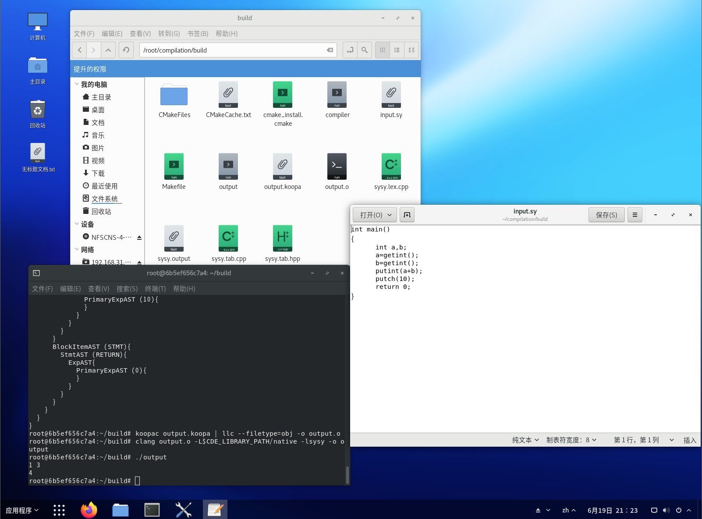
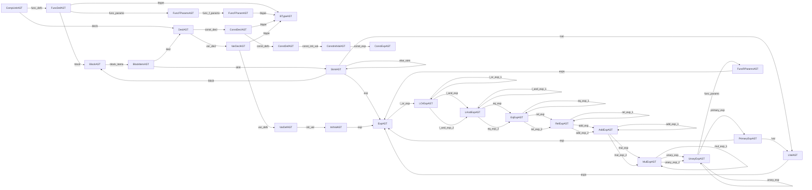

# SysY编译器设计与实现

## 0 基础背景
*参考文档* [北大编译实践在线文档](https://pku-minic.github.io/online-doc/#/misc-app-ref/sysy-spec)
### 0.1 框架

**前端**: 通过**词法分析和语法分析**，将源代码解析成抽象语法树 (abstract syntax tree, **AST**)。 通过**语义分析**，扫描抽象语法树，解析抽象语法树的语义。
**中端**: **将抽象语法树转换为中间表示** (intermediate representation，IR)，并在此基础上完成一些机器无关优化。
**后端**: 将中间表示转换为目标平台的汇编代码，并在此基础上完成一些机器相关优化。

### 0.2 词法分析

词法分析的作用，是把字节流转换为单词流 (token stream)。词法分析器 (lexer) 会按照某种规则读取文件，并将文件的内容拆分成一个个 token 作为输出, 传递给语法分析器 (parser)。同时，lexer 还会忽略文件里的一些无意义的内容，比如空格，换行符和注释。

**Lexer 生成的 token 会包含一些信息**，用来让 parser 区分 token 的种类, 以及在必要时获取 token 的内容. 例如int main可能能被转换成如下的 token 流:
    
```cpp
int main() {
  return 0;
}
```
1.种类: 关键字, 内容: int.
2.种类: 标识符, 内容: main.
3.种类: 其他字符, 内容: (.
4.种类: 其他字符, 内容: ).
5.种类: 其他字符, 内容: {.
6.种类: 关键字, 内容: return.
7.种类: 整数字面量, 内容: 0.
8.种类: 其他字符, 内容: ;.
9.种类: 其他字符, 内容: }.

得到的终极符是这样的
```
"int" IDENT "(" ")" "{" "return" INT_CONST ";" "}"
```

### 0.3 语法分析

语法分析的目的是，按照**程序的语法规则**，例如，对于 SysY 程序，关键字 int 后跟的一定是一个标识符, 而不可能是一个整数字面量），**将输入的 token 流变成程序的 AST**

**Parser 会通过某些语法分析算法**，例如 LL 分析法或 LR 分析法，**对 token 流做一系列的分析, 并最终得到 AST**。

上述程序经分析后, 可能能得到如下的 AST:
``` cpp
CompUnit {
  items: [
    FuncDef {
      type: "int",
      name: "main",
      params: [],
      body: Block {
        stmts: [
          Return {
            value: 0
          }
        ]
      }
    }
  ]
}
```

### 0.4 语义分析

**语法分析的基础上，编译器会对 AST 做进一步的语义分析, 以期 “理解” 输入程序的语义**，为之后的 IR 生成做准备。

**语义分析阶段**，编译器通常会：

- **建立符号表**，跟踪程序里变量的声明和使用，**确定程序在某处用到了哪一个变量，同时也可发现变量重复定义/引用未定义变量之类的错误。**

- **进行类型检查**，确定程序中是否存在诸如 “对整数变量进行数组访问” 这种类型问题。同时标注程序中表达式的类型，以便进行后续的生成工作。对于某些编程语言（例如 C++11 之后的 C++、Rust 等等，编译器还会进行类型推断.

- **进行必要的编译期计算**，SysY 中支持使用常量表达式作为数组定义时的长度，而我们**在生成 IR 之前，必须知道数组的长度** (SysY 不支持 VLA)，这就要求编译器**必须能在编译的时候算出常量表达式的值**, 同时对那些无法计算的常量表达式报错。对于某些支持元编程的语言，这一步可能会非常复杂。

**至此, 我们就能得到一个语法正确, 语义清晰的 AST 表示了。**

### 0.5 中间代码（IR）生成
编译器通常不会直接通过扫描 AST 来生成目标代码 (汇编)，而是会先将 AST 转换为一种中间表示 (IR，intermediate representation)，**IR 的抽象层次比 AST 更低**，然后再将 IR 转换为目标代码。

如果我们先把所有源语言都转换到同一种 IR，然后再将这种 IR 翻译为不同的目标代码，我们就只需要开发 M种语言+N种指令系统相关模块。

例如 LLVM IR 就是一种被广泛使用的 IR。此时，编译器的前后端是完全解耦的, 两部分可以各自维护, 十分方便。

**本实验课中我们使用的[koopa IR](https://pku-minic.github.io/online-doc/#/misc-app-ref/koopa)也是一种和LLVM IR类似的中间表示，但相对有所简化。**
例如int main的Koopa IR大致如下所示：

```

decl @getint(): i32
decl @getch(): i32
decl @getarray(*i32): i32
decl @putint(i32)
decl @putch(i32)
decl @putarray(i32, *i32)
decl @starttime()
decl @stoptime()

fun @main(): i32 {
%entry:
  ret 0
}
```

### 0.6 目标代码生成

- **指令选择**: 决定 IR 中的指令应该被翻译为哪些目标指令系统的指令. 例如前文的 Koopa IR 程序中出现的 lt 指令可以被翻译为 RISC-V 中的 slt/slti 指令.
  **这里可以根据[北大的koopa IR C++接口文档进行实现](https://github.com/BerkinChen/pku-compiler)，使用对应的接口函数对Koopa IR进行目标代码生成的操作.**

- 寄存器分配: 决定 IR 中的值和指令系统中寄存器的对应关系. 例如前文的 Koopa IR 程序中的 @x, %cond, %0 等等, 它们最终可能会被放在 RISC-V 的某些寄存器中. 由于指令系统中寄存器的数量通常是有限的 (RISC-V 中只有 32 个整数通用寄存器, 且它们并不都能用来存放数据), 某些值还可能会被分配在内存中.

- 指令调度: 决定 IR 生成的指令序列最终的顺序如何. 我们通常希望编译器能生成一个最优化的指令序列, 它可以最大程度地利用目标平台的微结构特性, 这样生成的程序的性能就会很高. 例如编译器可能会穿插调度访存指令和其他指令, 以求减少访存导致的停顿.

**至此，编译器的大致结构已经说明完毕。**

## 1 项目概述

### 1.1 基本功能

本项目实现了从 SysY 语言（一种简化的 C 语言）到 RISC-V 汇编语言的编译器。SysY 的设计旨在教学和研究编译原理中使用，而本编译器则将其转换为符合 RV32IM 指令集的 RISC-V 汇编。转换过程首先将 SysY 源代码转化为 Koopa IR，一种中间表示形式，然后再转换为目标 RISC-V 汇编代码。

要运行编译器，用户可以通过在命令行中使用特定的参数来生成不同的代码表示，如下所示：

```sh
make
build/compiler -koopa SysY文件路径 -o KoopaIR文件路径
build/compiler -riscv SysY文件路径 -o RISC-V文件路径
```

环境提供了运行中间代码的方式，如下所示：

```sh
koopac KoopaIR文件路径 | llc --filetype=obj -o o文件路径
clang o文件路径 -L$CDE_LIBRARY_PATH/native -lsysy -o 可执行文件路径
./hello
```

### 1.2 主要特点

- **双层中间表示策略**: 编译过程首先生成一个高级的抽象语法树，随后转换为更低层的 Koopa IR。这一分层方法确保了处理的灵活性和效率，抽象语法树主要用于捕捉和组织语法结构，而 Koopa IR 负责详细描述操作和控制流。

- **前后端低耦合**: 我们的编译器前端负责生成规范的 Koopa IR，后端则侧重于将此中间代码转化为汇编。两者之间的接口明确，互不干扰。

- **栈式符号表管理**: 编译过程中使用栈式符号表来管理变量和作用域，保证了名字解析的正确性和高效性。每当进入一个新的作用域，符号表就增加一层；每结束一个作用域，就将其弹出。

- **语法树结构生成**: 为了更好地理解语法树的结构，我们实现了一个名为 ScopeHelper 的工具，该工具通过利用构造函数和析构函数在控制台生成抽象语法树的结构，从而帮助开发者和学习者可视化理解程序结构。此工具在每个作用域的进入和退出时输出对应的缩进，清晰地展示了程序的嵌套层次。

此外，编译器的所有环境均运行于**中科方德操作系统**上，充分利用了其稳定和高效的系统环境来优化编译过程。需要注意的是，后端部分的实现基于现有的开源项目，我们主要集中在前端的开发和优化上，以保证 SysY 代码能被准确地转换为有效的中间表示。



### 1.3 主要模块组成

编译器主要由以下几个核心组件构成：

- **词法分析器**: 这一模块负责将SysY语言的源代码转化为标记（token）流。此部分由 `sysy.l` 文件中的规则定义。
- **语法分析器**: 语法分析器根据定义在 `sysy.y` 文件中的规则，解析token流并构建出定义在 `AST.h` 中的抽象语法树（AST）。
- **中间代码生成**: 该模块通过遍历抽象语法树，同时执行语义检查和中间代码的生成，输出Koopa IR，这一部分由 `AST.[h|cpp]` 文件实现。
- **目标代码生成器**: 这个模块分析Koopa IR，将其翻译为RISC-V汇编指令。实现代码位于 `visit.[h|cpp]` 文件中。

这样的结构设计确保了编译过程的高效和模块间的清晰分工，同时使得每一部分都可以独立更新和优化，提高了整个编译系统的可维护性和扩展性。

### 1.4 工具使用

我们在模块交互和传递数据流时使用了如下工具：

- **Make**: 这是一个用于自动化编译流程的工具。通过使用一个名为 Makefile 的配置文件，Make 自动化管理编译过程。在这个文件中，开发者定义如何编译各个源文件以及它们如何链接成最终的执行文件，同时指定文件间的依赖关系。一旦 Makefile 编写完毕，开发者只需在命令行中执行 make 命令，即可自动完成整个编译过程，极大地简化了编译操作。

- **Flex**: 一个用于词法分析的强大工具，负责处理EBNF中的**终结符**，即识别和分类源代码中的各种标记（tokens）。通过正则表达式来描述不同的标记。
- **Bison**: 这是一个语法分析工具，通常与 Flex 协同工作，用于解析并构建EBNF规则。Bison 允许开发者定义上下文无关的文法规则，基于Flex输出的标记流生成一个**LALR(1)解析器**。

此外，项目中还包含了一些辅助性的模块，如 `Symbol.[h|cpp]` 提供了符号表及类型信息的定义，而 `utils.h` 则包括了各种辅助工具类，比如用于管理Koopa IR的`KoopaIR`类。


## 2 词法分析

写正则表达式和其他规则等

## 3 语法分析

把北大语法文档拉过来引用一下
抽象语法树，介绍和语法有关的抽象结构
抽象语法树在`AST.h`中定义。所有抽象语法树结点都继承自基类`BaseAST`。

```cpp
class BaseAST {
public:
    virtual ~BaseAST() = default;
};
```

抽象语法树结点类的定义，基本是仿照产生式给出的。例如，产生式

```
FuncDef       ::= FuncType IDENT "(" [FuncFParams] ")" Block;
```

给出的 AST 定义如下：

```cpp
class FuncDefAST : public BaseAST {
public:
    std::unique_ptr<BTypeAST> btype;    // 返回值类型
    std::string ident;                  // 函数名标识符
    std::unique_ptr<FuncFParamsAST> func_params;    // 函数参数, nullptr则无参数
    std::unique_ptr<BlockAST> block;    // 函数体
    void Dump() const;
};
```

其他AST结点的定义方式与之类似

## 4 语义分析

### 4.1 符号的类型

为了记录符号的类型，在`Symbol.h`中定义了专门的类`SysYType`。

```cpp
class SysYType{
    public:
        enum TYPE{
            SYSY_INT, SYSY_INT_CONST, SYSY_FUNC_VOID, SYSY_FUNC_INT,
            SYSY_ARRAY_CONST, SYSY_ARRAY // SYSY的种类
        };
        TYPE ty;
        int value;
        SysYType *next;
        SysYType(); // 初始化
        SysYType(TYPE _t);
        SysYType(TYPE _t, int _v);
        SysYType(TYPE _t, const std::vector<int> &len);

        ~SysYType();
};
```

`SysYType`有三个字段，`ty`、`value`和`next`。

+ `ty`表名类型，如`SYSY_INT`表示是一个整型、`SYSY_FUNC_VOID`表示这是一个返回值为空的函数
+ `value`存储的是常量

### 4.2 符号表

主要涉及：`NameTable`、`Symbol`、`STable`

**NameTable**：用于处理重复的变量名
**Symbol**：表示一个表项 包括标识符 ident、名称 name
**STable**：表示一个大表 有标识符 ident、名称 name、类型 type 和值 value 

#### 4.2.1 NameTable

**NameTable**: 用来处理重复的变量名
**getTmpName**: 返回一个临时的符号，如`%1`
**getName**: 返回一个标识符，返回中间代码
**getLabelName**:返回 Koopa IR 基本块的标签

```cpp
class NameTable{
private:
    int cnt;
    std::unordered_map<std::string, int> no;
public:
    NameTable():cnt(0){}
    void reset();
    std::string getTmpName(); // 返回临时的符号
    std::string getName(const std::string &s); // @ 
    std::string getLabelName(const std::string &s); // % 
};
```
#### 4.2.2 Symbol

`Symbol`是符号表中的一个表项，记录了SysY中的变量的信息，定义如下：

```cpp
class Symbol{
public:
    std::string ident;   // SysY标识符，诸如x,y
    std::string name;    // KoopaIR中的具名变量
    SysYType *ty;
    Symbol(const std::string &_ident, const std::string &_name, SysYType *_t); // 标识符 _ident、名称 _name 和类型指针 _t 
    ~Symbol();
};
```

#### 4.2.3 STable

`STable`是符号表，是`Symbol`条目按照`ident`字段进行的索引，为一个基本块中的信息。
里面涉及到插入符号表，查找标识符是否存在，`getValue`、`getName`等操作返回符号表的值和名字。

```cpp
class STable{
public:
    const int UNKNOWN = -1;
    std::unordered_map<std::string, Symbol *> symbol_tb;  // ident -> Symbol 
    STable() = default;
    ~STable();
    void insert(Symbol *symbol);
    // insert 函数重载：根据标识符 ident、名称 name、类型 _type 和值 value 创建一个新的符号并插入符号表
    void insert(const std::string &ident, const std::string &name, SysYType::TYPE _type, int value);
    // 在符号表中插入
    void insertINT(const std::string &ident, const std::string &name);
    void insertINTCONST(const std::string &ident, const std::string &name, int value);
    void insertFUNC(const std::string &ident, const std::string &name, SysYType::TYPE _t);
    bool exists(const std::string &ident); // 给出标识符查找是否存在
    Symbol *Search(const std::string &ident);
    // 根据标识符 ident 在符号表中查找并返回对应的 Symbol 对象指针
    int getValue(const std::string &ident);
    // 返回value 值
    SysYType *getType(const std::string &ident);
    // 返回SysYType 指针
    std::string getName(const std::string &ident);
    // 返回 name 
};
```

`STable`封装了命名管理器`NameTable`。
`STable`具体实现如下： 

```cpp
void STable::insert(Symbol *symbol){
    symbol_tb.insert({symbol->ident, symbol});
} 
// 创建一个新的符号并插入符号表
void STable::insert(const std::string &ident, const std::string &name, SysYType::TYPE _type, int value){
    SysYType *ty = new SysYType(_type, value);
    Symbol *sym = new Symbol(ident, name, ty);
    insert(sym);
}

// 在符号表中插入
void STable::insertINT(const std::string &ident, const std::string &name){
    insert(ident, name, SysYType::SYSY_INT, UNKNOWN);
}

void STable::insertINTCONST(const std::string &ident, const std::string &name, int value){
    insert(ident, name, SysYType::SYSY_INT_CONST, value);
}

void STable::insertFUNC(const std::string &ident, const std::string &name, SysYType::TYPE _t){
    insert(ident, name, _t, UNKNOWN);
}

// 查找符号表中是否存在标识符
bool STable::exists(const std::string &ident){
    return symbol_tb.find(ident) != symbol_tb.end();
}

// 根据标识符 ident 在符号表中查找并返回对应的 Symbol 对象指针
Symbol *STable::Search(const std::string &ident){
    return symbol_tb.find(ident)->second;
}

// 返回给定标识符 ident 对应的 Symbol 的 value 值
int STable::getValue(const std::string &ident){
    return symbol_tb.find(ident)->second->ty->value;
}

// 返回给定标识符 ident 对应的 Symbol 的 SysYType 指针
SysYType *STable::getType(const std::string &ident){
    return symbol_tb.find(ident)->second->ty;
}

// 返回给定标识符 ident 对应的 Symbol 的 name 属性
std::string STable::getName(const std::string &ident){
    return symbol_tb.find(ident)->second->name;
}

```

### 4.3 符号栈

`SStack`是`STable`组成的栈，同时用命名管理器`NameTable`处理重名变量。

```cpp
class SStack{
private:
    std::deque<std::unique_ptr<STable>> sym_tb_st;
    NameTable nt;
public:
    const int UNKNOWN = -1;
    void alloc();// 在栈顶分配一个新的符号表
    void quit();// 从栈顶弹出一个符号表
    void resetNameTable();
    void insert(Symbol *symbol);// 插入一个符号
    void insert(const std::string &ident, SysYType::TYPE _type, int value);
    void insertINT(const std::string &ident);
    void insertINTCONST(const std::string &ident, int value);
    void insertFUNC(const std::string &ident, SysYType::TYPE _t);
    // 上述为插入各个类型的符号
    bool exists(const std::string &ident);// 一个标识符是否存在于符号表栈中的任何一个作用域
    int getValue(const std::string &ident);// 查找值
    SysYType *getType(const std::string &ident);// 查找符号的类型
    std::string getName(const std::string &ident);// 查找name

    std::string getTmpName();   // 继承 name manager
    std::string getLabelName(const std::string &label_ident); // 继承 name manager
    std::string getVarName(const std::string& var);   // 获取 var name
};
```

我们可以调用`insert`用来插入一个表项，调用栈顶`STable`的`insert`函数。
如果是插入基本类型，那么这将先调用命名管理器`getName`，获得这个标识符`ident`在 `Koopa IR` 中具有的唯一名字，再将其插入栈顶符号表。
这些`get`开头查找的函数从栈顶往下开始找标识符ident，第一次找到就是该ident所在的作用域对应的符号表。返回这个表中标识符ident对应的Name或者Value。

如果我们给出input.sy中的代码：
```cpp
int gv = 0;

int addgv(int n)
{
    gv = gv + n;
    return gv;
}

```
符号表栈中有两个符号表：
第一个：
Ident: gv, Name: gv, Type: INT, Value: 0
第二个：
Ident: addgv, Name: addgv, Type: FUNC, Value: -1
Ident: gv, Name: gv, Type: INT, Value: -1
Ident: n, Name: n, Type: INT, Value: -1
在NameTable中查找gv，然后更新符号表即可。

## 5 中间代码生成

### 5.1 语法树

#### 5.1.1 定义

在编译器设计中，抽象语法树（AST）是源代码的抽象符号表示，用来表示程序的语法结构。它通过树形结构体现出程序编写的层次性，其中每个节点都代表了源代码中的一种结构，如表达式、语句或声明。

首先，我们定义了 **基类（BaseAST）**，即为所有语法树节点的基类，定义了通用的接口和抽象方法。这个基础类允许通过多态处理各种不同类型的语法树节点。这种设计允许编译器的其他组件统一处理不同类型的节点，而无需知道节点的具体类型。

```cpp
class BaseAST {
public:
    virtual ~BaseAST() = default;  // 确保派生类的正确析构
};
```

每个具体的AST类都是从`BaseAST`派生的，并代表语法分析阶段中的一个特定的语法构造。例如，`FuncDefAST` 类代表一个函数定义，它直接映射到语法中的函数定义产生式：

```cpp
// FuncDef       ::= FuncType IDENT "(" [FuncFParams] ")" Block;
class FuncDefAST : public BaseAST {
public:
    std::unique_ptr<BTypeAST> btype;    // 函数返回类型
    std::string ident;                  // 函数名
    std::unique_ptr<FuncFParamsAST> func_params; // 函数参数列表
    std::unique_ptr<BlockAST> block;    // 函数体的AST节点

    void Dump() const; // 递递归地生成中间代码
};
```

在AST中，节点通常使用指针来表示子节点，这主要有几个原因：
- **动态绑定**：使用指针可以在运行时解析具体的节点类型，利用多态进行适当的处理。
- **灵活的树结构管理**：指针使得添加、移除和修改子节点变得简单，因为这些操作不需要在连续的内存空间中进行。
- **内存管理**：使用智能指针（如 `std::unique_ptr`）可以自动管理节点的生命周期，避免内存泄漏，并简化复杂树结构的内存管理。

通过这种方式，编译器前端将源代码转换为AST，后续的过程如优化和代码生成则直接操作这些抽象的表示形式，从而有效地进行程序分析和转换，最终生成高效的目标代码。

我们将类间关系通过来表示如下，或点击[**链接**](file/类间关系.pdf)查看：



#### 5.1.2 结构生成器

在编译过程中，有效地可视化和调试语法树结构是极为重要的。为了支持这一需求，我们实现了一个名为 `ScopeHelper` 的辅助类。该类的主要目的是在进入和退出编译器的各个作用域时自动记录和显示层次结构，帮助开发者清晰地看到程序的嵌套层次和作用域边界。

`ScopeHelper` 通过使用构造函数和析构函数在控制台输出括号表示的作用域，从而提供一种结构化的方式来可视化语法树的节点。它在每个节点的开始打印一个开括号，节点的结束打印一个闭括号，并根据当前的嵌套深度自动调整缩进。此外，如果提供了节点名称，它还会在类型名后输出，使得输出更加具体和有用。

使用 `ScopeHelper` 可以非常直观地生成编译器前端从源代码生成的抽象语法树结构，极大地方便了开发和调试过程。

```cpp
class ScopeHelper {
private:
    static int depth;  // 静态变量，用于记录当前嵌套层数
    std::string type;
    std::string name;

    // 辅助函数，用于生成当前层次的缩进
    std::string getIndent() const {
        return std::string(depth * 2, ' ');  // 每层缩进两个空格
    }

public:
    ScopeHelper(const std::string& type, const std::string& name = "") : type(type), name(name) {
        std::cout << getIndent();  // 输出当前缩进
        std::cout << type;  // 输出类型名
        if (!name.empty()) {
            std::cout << " (" << name << ")";  // 如果变量名不为空，则输出变量名
        }
        std::cout << "{" << std::endl;
        depth++;  // 进入新的层级
    }
    ~ScopeHelper() {
        depth--;  // 退出当前层级
        std::cout << getIndent() << "}" << std::endl;
    }
};

// 初始化静态成员变量
int ScopeHelper::depth = 0;
```

以 CompUnitAST 节点为例，可以在 Dump() 方法的开头定义 ScopeHelper 类。如下所示：

```cpp
void CompUnitAST::Dump()const {
    ScopeHelper scope("CompUnitAST");
    // 函数体
}
```

#### 5.1.3 可视化

在编译器的开发过程中，对抽象语法树（AST）进行可视化能够帮助开发者理解源代码经过语法分析后的结构，并验证编译器是否正确地解析了程序结构。为了实现这一点，我们使用了mermaid，一个流行的图形化工具，来绘制抽象语法树的图形表示。我们通过将AST的结构转换为mermaid图表，可以生成清晰、直观的树形图，这对于调试和展示编译器的工作流程至关重要。

例如对于如下代码，其覆盖了函数定义、条件语句、循环和基本运算等核心编程结构。我们通过mermaid绘制了它的抽象语法树。

- **样例代码**

```cpp
int gv = 0;

int addgv(int n)
{
    gv = gv + n;
    return gv;
}

int pow(int x, int y)
{    
    int res = 1;
    while (y > 0)
    {
        res = res * x;
    	y = y - 1;
    }
    return res;
}

int f()
{
    int a = 3;
    while(1)
    {
        a = a - 1;
        if(a <= 0) break;
    }
    return 0;
}

int main()
{
    const int a = 1;
    int x = 2, y = 3;
    
    int c;
    c = pow(x, y);
    
    if(c == 8)
    {
        c = c - 1;
    }

    if(c != 8)
    {
        f();
    }
    return 0;
}
```

- **抽象语法树**

如下所示，或点击[**链接**](file/样例语法树.pdf)查看。

```mermaid
graph TD
    CompUnitAST --> VarDefAST_gv
    VarDefAST_gv --> PrimaryExpAST_0

    CompUnitAST --> FuncDefAST_addgv
    FuncDefAST_addgv --> FuncFParamAST_addgv
    FuncDefAST_addgv --> BTypeAST_i32_addgv
    FuncDefAST_addgv --> BlockAST_addgv

    BlockAST_addgv --> BlockItemAST_STMT_addgv1
    BlockItemAST_STMT_addgv1 --> StmtAST_ASSIGN_addgv1
    StmtAST_ASSIGN_addgv1 --> ExpAST_addgv1
    ExpAST_addgv1 --> AddExpAST_addgv1
    ExpAST_addgv1 --> PrimaryExpAST_gv_addgv
    ExpAST_addgv1 --> PrimaryExpAST_n_addgv
    StmtAST_ASSIGN_addgv1 --> LValAST_gv_addgv

    BlockAST_addgv --> BlockItemAST_STMT_addgv2
    BlockItemAST_STMT_addgv2 --> StmtAST_RETURN_addgv
    StmtAST_RETURN_addgv --> ExpAST_gv_addgv
    ExpAST_gv_addgv --> PrimaryExpAST_gv_addgv2

    CompUnitAST --> FuncDefAST_pow
    FuncDefAST_pow --> FuncFParamAST_pow1
    FuncDefAST_pow --> FuncFParamAST_pow2
    FuncDefAST_pow --> BTypeAST_i32_pow
    FuncDefAST_pow --> BlockAST_pow

    BlockAST_pow --> BlockItemAST_DECL_pow
    BlockItemAST_DECL_pow --> VarDeclAST_pow
    VarDeclAST_pow --> VarDefAST_res_pow
    VarDefAST_res_pow --> ExpAST_res_pow
    ExpAST_res_pow --> PrimaryExpAST_1_pow

    BlockAST_pow --> BlockItemAST_STMT_pow1
    BlockItemAST_STMT_pow1 --> StmtAST_WHILE_pow
    StmtAST_WHILE_pow --> ExpAST_pow1
    ExpAST_pow1 --> RelExpAST_pow
    ExpAST_pow1 --> PrimaryExpAST_y_pow
    ExpAST_pow1 --> PrimaryExpAST_0_pow
    StmtAST_WHILE_pow --> StmtAST_BLOCK_pow

    StmtAST_BLOCK_pow --> BlockAST_pow_inner
    BlockAST_pow_inner --> BlockItemAST_STMT_pow_inner1
    BlockItemAST_STMT_pow_inner1 --> StmtAST_ASSIGN_pow1
    StmtAST_ASSIGN_pow1 --> ExpAST_pow_inner1
    ExpAST_pow_inner1 --> MulExpAST_pow
    ExpAST_pow_inner1 --> PrimaryExpAST_res_pow1
    ExpAST_pow_inner1 --> PrimaryExpAST_x_pow
    StmtAST_ASSIGN_pow1 --> LValAST_res_pow1

    BlockAST_pow_inner --> BlockItemAST_STMT_pow_inner2
    BlockItemAST_STMT_pow_inner2 --> StmtAST_ASSIGN_pow2
    StmtAST_ASSIGN_pow2 --> ExpAST_pow_inner2
    ExpAST_pow_inner2 --> AddExpAST_pow
    ExpAST_pow_inner2 --> PrimaryExpAST_y_pow1
    ExpAST_pow_inner2 --> PrimaryExpAST_1_pow2
    StmtAST_ASSIGN_pow2 --> LValAST_y_pow1

    BlockAST_pow --> BlockItemAST_STMT_pow2
    BlockItemAST_STMT_pow2 --> StmtAST_RETURN_pow
    StmtAST_RETURN_pow --> ExpAST_res_pow2
    ExpAST_res_pow2 --> PrimaryExpAST_res_pow2
    
    CompUnitAST --> FuncDefAST_f
    FuncDefAST_f --> BTypeAST_i32_f
    FuncDefAST_f --> BlockAST_f

    BlockAST_f --> BlockItemAST_DECL_f
    BlockItemAST_DECL_f --> VarDeclAST_f
    VarDeclAST_f --> VarDefAST_a_f
    VarDefAST_a_f --> ExpAST_a_f
    ExpAST_a_f --> PrimaryExpAST_3_f

    BlockAST_f --> BlockItemAST_STMT_f1
    BlockItemAST_STMT_f1 --> StmtAST_WHILE_f
    StmtAST_WHILE_f --> ExpAST_f1
    ExpAST_f1 --> PrimaryExpAST_1_f
    StmtAST_WHILE_f --> StmtAST_BLOCK_f

    StmtAST_BLOCK_f --> BlockAST_f_inner
    BlockAST_f_inner --> BlockItemAST_STMT_f_inner1
    BlockItemAST_STMT_f_inner1 --> StmtAST_ASSIGN_f
    StmtAST_ASSIGN_f --> ExpAST_f_inner1
    ExpAST_f_inner1 --> AddExpAST_f
    ExpAST_f_inner1 --> PrimaryExpAST_a_f1
    ExpAST_f_inner1 --> PrimaryExpAST_1_f2
    StmtAST_ASSIGN_f --> LValAST_a_f1

    BlockAST_f_inner --> BlockItemAST_STMT_f_inner2
    BlockItemAST_STMT_f_inner2 --> StmtAST_IF_f
    StmtAST_IF_f --> ExpAST_f2
    ExpAST_f2 --> RelExpAST_f
    ExpAST_f2 --> PrimaryExpAST_a_f2
    ExpAST_f2 --> PrimaryExpAST_0_f
    StmtAST_IF_f --> StmtAST_BREAK_f

    BlockAST_f --> BlockItemAST_STMT_f2
    BlockItemAST_STMT_f2 --> StmtAST_RETURN_f
    StmtAST_RETURN_f --> ExpAST_f3
    ExpAST_f3 --> PrimaryExpAST_0_f2

    CompUnitAST --> FuncDefAST_main
    FuncDefAST_main --> BTypeAST_i32_main
    FuncDefAST_main --> BlockAST_main

    BlockAST_main --> BlockItemAST_DECL_main1
    BlockItemAST_DECL_main1 --> ConstDeclAST_main
    ConstDeclAST_main --> ConstDefAST_a_main
    ConstDefAST_a_main --> PrimaryExpAST_1_main

    BlockAST_main --> BlockItemAST_DECL_main2
    BlockItemAST_DECL_main2 --> VarDeclAST_main
    VarDeclAST_main --> VarDefAST_x_main
    VarDefAST_x_main --> ExpAST_x_main
    ExpAST_x_main --> PrimaryExpAST_2_main
    VarDeclAST_main --> VarDefAST_y_main
    VarDefAST_y_main --> ExpAST_y_main
    ExpAST_y_main --> PrimaryExpAST_3_main

    BlockAST_main --> BlockItemAST_DECL_main3
    BlockItemAST_DECL_main3 --> VarDeclAST_main2
    VarDeclAST_main2 --> VarDefAST_c_main

    BlockAST_main --> BlockItemAST_STMT_main1
    BlockItemAST_STMT_main1 --> StmtAST_ASSIGN_main
    StmtAST_ASSIGN_main --> ExpAST_main1
    ExpAST_main1 --> ExpAST_x_main1
    ExpAST_x_main1 --> PrimaryExpAST_x_main1
    ExpAST_main1 --> ExpAST_y_main1
    ExpAST_y_main1 --> PrimaryExpAST_y_main2
    StmtAST_ASSIGN_main --> LValAST_c_main1

    BlockAST_main --> BlockItemAST_STMT_main2
    BlockItemAST_STMT_main2 --> StmtAST_IF_main1
    StmtAST_IF_main1 --> ExpAST_main2
    ExpAST_main2 --> EqExpAST_main
    ExpAST_main2 --> PrimaryExpAST_c_main1
    ExpAST_main2 --> PrimaryExpAST_8_main
    StmtAST_IF_main1 --> StmtAST_BLOCK_main1

    StmtAST_BLOCK_main1 --> BlockAST_main_inner1
    BlockAST_main_inner1 --> BlockItemAST_STMT_main_inner1
    BlockItemAST_STMT_main_inner1 --> StmtAST_ASSIGN_main1
    StmtAST_ASSIGN_main1 --> ExpAST_main_inner1
    ExpAST_main_inner1 --> AddExpAST_main
    ExpAST_main_inner1 --> PrimaryExpAST_c_main2
    ExpAST_main_inner1 --> PrimaryExpAST_1_main1
    StmtAST_ASSIGN_main1 --> LValAST_c_main2

    BlockAST_main --> BlockItemAST_STMT_main3
    BlockItemAST_STMT_main3 --> StmtAST_IF_main2
    StmtAST_IF_main2 --> ExpAST_main3
    ExpAST_main3 --> EqExpAST_main2
    ExpAST_main3 --> PrimaryExpAST_c_main3
    ExpAST_main3 --> PrimaryExpAST_8_main1
    StmtAST_IF_main2 --> StmtAST_BLOCK_main2

    StmtAST_BLOCK_main2 --> BlockAST_main_inner2
    BlockAST_main_inner2 --> BlockItemAST_STMT_main_inner2
    BlockItemAST_STMT_main_inner2 --> StmtAST_EXP_main
    StmtAST_EXP_main --> ExpAST_main4

    BlockAST_main --> BlockItemAST_STMT_main4
    BlockItemAST_STMT_main4 --> StmtAST_RETURN_main
    StmtAST_RETURN_main --> ExpAST_main5
    ExpAST_main5 --> PrimaryExpAST_0_main3
```



通过这个样例，我们展示了对于一个简单的SysY语言程序，其生成对应AST的结构。

### 5.2 变量

在编译过程中，变量的处理是通过一系列的声明（`DeclAST`）来管理的。这些声明包括常量声明（`ConstDeclAST`）和变量声明（`VarDeclAST`），它们分别对应于不同的语法结构。这些结构在语法树中被表示为相应的节点，并通过相应的类进行操作。

#### 5.2.1 声明类型

- **常量声明 (`ConstDeclAST`)**：每个常量声明包含一组常量定义（`ConstDefAST`），这些定义指定了常量的名称、类型及其初始值。常量声明还关联一个类型节点（`BTypeAST`），它指定了常量的数据类型，如整型。
  
- **变量声明 (`VarDeclAST`)**：类似于常量声明，变量声明包含一组变量定义（`VarDefAST`），这些定义指定了变量的名称、类型和（可选的）初始值。变量声明也包含一个类型节点（`BTypeAST`），用于指定变量的数据类型。

#### 5.2.2 类的定义和方法

以下是几个关键类的定义和主要方法：

- **`DeclAST`**：抽象基类，用于表示所有声明，其包含一个标签字段来区分是常量声明还是变量声明。提供一个`Dump`方法，用于生成相应的中间代码。

```cpp
class DeclAST : public BaseAST {
public:
    enum TAG {CONST_DECL, VAR_DECL};
    TAG tag;
    std::unique_ptr<ConstDeclAST> const_decl;
    std::unique_ptr<VarDeclAST> var_decl;
    void Dump() const;
};
```

- **`ConstDeclAST`**:
  - 表示常量声明，包含多个常量定义。
  - 提供一个`Dump`方法来遍历并生成每个常量定义的中间代码。

```cpp
class ConstDeclAST : public BaseAST {
public:
    std::vector<std::unique_ptr<ConstDefAST>> const_defs;
    std::unique_ptr<BTypeAST> btype;
    void Dump() const;
};
```

- **`VarDeclAST`**：表示变量声明，包含多个变量定义。`Dump`方法遍历并生成每个变量定义的中间代码。

```cpp
class VarDeclAST : public BaseAST {
public:
    std::vector<std::unique_ptr<VarDefAST>> var_defs;
    std::unique_ptr<BTypeAST> btype;
    void Dump() const;
};
```

- **`ConstDefAST` 和 `VarDefAST`**：`ConstDefAST`用于定义常量，`VarDefAST`用于定义变量。其中每个定义类包括一个标识符和可能的初始化值。`Dump`方法生成中间代码，如果定义中包括初始化值，则会处理这些值。

```cpp
class ConstDefAST : public BaseAST {
public:
    std::string ident;
    std::unique_ptr<ConstInitValAST> const_init_val;
    void Dump(bool is_global = false) const;
};

class VarDefAST: public BaseAST {
public:
    std::string ident;
    std::unique_ptr<InitValAST> init_val;   // nullptr implies no init_val
    void Dump(bool is_global = false) const;
};
```

- **`InitValAST` 和 `ConstInitValAST`**：`InitValAST`表示初始化值，通常与`VarDefAST`关联。`ConstInitValAST`用于常量定义，用于计算和存储常量的值。

```cpp
class InitValAST : public BaseAST {
public:
    std::unique_ptr<ExpAST> exp;
    std::string Dump() const;
};

class ConstInitValAST : public BaseAST {
public:
    std::unique_ptr<ConstExpAST> const_exp;
    int getValue();
};
```

#### 5.2.3 中间代码生成

在中间代码生成阶段，各种声明和定义类的`Dump`方法被调用以生成对应的Koopa IR。例如，`VarDeclAST`的`Dump`方法会遍历所有变量定义并生成相应的初始化代码，如果变量有初始值的话：

```cpp
void VarDeclAST::Dump() const {
    ScopeHelper scope("VarDeclAST");
    int n = var_defs.size();
    for(int i = 0; i < n; ++i){
        var_defs[i]->Dump();    // 初始话变量列表，例如 int a = 1, b, c;
    }
}
```

### 5.3 语句

在编译器中，语句的处理涉及到各种程序控制结构如条件判断、循环、赋值等。这些结构通过不同的语句节点（`StmtAST`）来实现，每种节点对应于一种特定的语法结构。

#### 5.3.1 语句的种类和处理

`StmtAST`类是语句的基类，其枚举`TAG`标识了语句的类型。不同类型的语句如赋值、循环、条件判断等，都在这个类中得到了处理。

```cpp
class StmtAST : public BaseAST {
public:
    enum TAG {RETURN, ASSIGN, BLOCK, EXP, WHILE, BREAK, CONTINUE, IF};
    TAG tag;
    std::unique_ptr<ExpAST> exp;
    std::unique_ptr<LValAST> lval;
    std::unique_ptr<BlockAST> block;
    std::unique_ptr<StmtAST> stmt;
    std::unique_ptr<StmtAST> if_stmt;
    std::unique_ptr<StmtAST> else_stmt;
};
```

- **赋值语句 (ASSIGN)**：对象赋值语句处理左值和表达式。使用`lval->Dump(true)`和`exp->Dump()`来生成相应的中间代码。
- **控制流语句 (IF, WHILE)**：控制流语句如`if`和`while`利用表达式结果来控制程序流。这些语句与`BlockController`和`WhileStack`有密切的交互，用于管理代码块的活动状态和循环控制。
- **中断语句 (BREAK, CONTINUE)**：`break`和`continue`语句用于中断当前循环。这些语句需要与`WhileStack`交互以确定跳转的目标标签。
- **返回语句 (RETURN)**：返回语句可能包含一个表达式，其结果作为函数返回值。如果表达式存在，调用`exp->Dump()`生成返回的中间代码。

#### 5.3.2 结构相关的辅助类

- **`BlockController`**：用于管理代码块的活动状态，特别是在遇到`return`、`break`或`continue`时。方法如`set()`, `finish()`和`alive()`用于控制和查询代码块的状态。

```cpp
class BlockController {
public:
    void set();    // 激活当前块
    void finish(); // 结束当前块
    bool alive();  // 检查当前块是否活跃
};
```
- **`WhileStack`**:
  - 管理循环的标签，如入口、循环体和结束标签。
  - 提供方法如`append()`和`quit()`来添加新循环的标签和结束当前循环。

```cpp
class WhileStack {
public:
    void append(const std::string& entry, const std::string& body, const std::string& end);
    void quit();
};
```

#### 5.3.3 中间代码生成示例

在语句处理中，不同类型的语句需要生成相应的Koopa IR代码。下面分别介绍几种主要语句类型的中间代码生成方法（以下代码为示意代码）：

##### 赋值语句 (ASSIGN)

赋值语句将一个表达式的值赋给一个变量。生成的中间代码首先计算右侧表达式的值，然后将该值存储到左值对应的地址。

```cpp
if (tag == ASSIGN) {
    string value = exp->Dump();   // 计算表达式并获取结果的临时变量名
    string variable = lval->Dump(true); // 获取左值变量的地址
    ki.store(value, variable);    // 生成存储指令
}
```

##### 代码块 (BLOCK)

代码块可能包含多个语句，需要逐个处理其中的每个语句。这通常涉及到递归地调用`Dump`方法。

```cpp
if (tag == BLOCK) {
    for (auto &item : block->block_items) {
        item->Dump(); // 递归处理块内的每个语句或声明
    }
}
```

##### 表达式语句 (EXP)

表达式语句主要是执行一个表达式并丢弃其结果，常用于如函数调用这样的表达式。

```cpp
if (tag == EXP) {
    exp->Dump(); // 计算表达式，不需要使用返回值
}
```

##### 条件语句 (IF)

条件语句根据表达式的结果选择执行两个不同的代码路径。生成的中间代码需要包括条件跳转。

```cpp
if (tag == IF) {
    string cond = exp->Dump(); // 计算条件表达式
    ki.br(cond, "then_label", "else_label"); // 生成条件跳转代码

    ki.label("then_label");
    if_stmt->Dump(); // 处理then部分
    ki.jump("end_label"); // 从then部分跳转到结束标签

    if (else_stmt) {
        ki.label("else_label");
        else_stmt->Dump(); // 处理else部分
    }

    ki.label("end_label"); // 设置结束标签
}
```

##### 循环控制 (WHILE, BREAK, CONTINUE)

循环语句根据条件反复执行代码块，而`break`和`continue`用于从循环中跳出或跳至循环开始。

```cpp
if (tag == WHILE) {
    string while_entry = "while_entry";
    string while_body = "while_body";
    string while_end = "while_end";

    wst.append(while_entry, while_body, while_end); // 记录循环标签
    ki.label(while_entry);
    string cond = exp->Dump(); // 条件表达式
    ki.br(cond, while_body, while_end); // 条件跳转指令

    ki.label(while_body);
    stmt->Dump(); // 循环体
    if (bc.alive()) {
        ki.jump(while_entry); // 循环结束后跳回开始
    }
    ki.label(while_end); // 设置循环结束标签
}

if (tag == BREAK) {
    ki.jump(wst.getEndName()); // 使用循环堆栈获取结束标签并跳转
    bc.finish(); // 设置当前代码块为不活跃状态
}

if (tag == CONTINUE) {
    ki.jump(wst.getEntryName()); // 使用循环堆栈获取入口标签并跳转
    bc.finish(); // 设置当前代码块为不活跃状态
}
```

#### 返回语句 (RETURN)

返回语句将一个表达式的结果作为函数的返回值，或者标记函数的退出点。

```cpp
if (tag == RETURN) {
    if (exp) {
        string result = exp->Dump(); // 计算返回表达式的值
        ki.ret(result);
    } else {
        ki.ret(""); // 无返回值的return
    }
}
```

### 5.4 表达式

表达式的解析通过一系列共同实现，这些类各司其职，依次调用（见图），实现形式类似递归。


这些类中均包含`Dump`方法和`getValue`方法。`Dump`方法用于生成计算表达式的中间代码，并返回存储结果的变量名；
`getValue`方法用于直接返回表达式的值。

具体实现方面，这些类的逻辑类似递归：分析标签，若是本类所处理的关系则处理，否则调用下一个类进行处理。

`ExpAST`类是表达式解析抽象程度最高的类，表达式解析从此开始，其调用`LOrExpAST`类，开始分析语句。
```cpp
//AST.h
class ExpAST : public BaseAST {
public:
    std::unique_ptr<LOrExpAST> l_or_exp;
    // 生成计算表达式的值的中间代码，返回存储该值的寄存器
    std::string Dump() const;
    // 直接返回表达式的值
    int getValue(); 
};
//AST.cpp
string ExpAST::Dump() const {
    ScopeHelper scope("ExpAST");
    return l_or_exp->Dump();
}
int ExpAST::getValue(){
    return l_or_exp->getValue();
}
```

以处理或表达式的`LOrExpAST`类中的`Dump`方法和`getValue`方法为例，若其发现表达式为`或`表达式，则开始进行处理并返回对应内容。

否则，返回下一个类`LAndExpAST`的`Dump`和`getValue`。

```cpp
// AST.h
// LOrExp        ::= LAndExp | LOrExp "||" LAndExp;
class LOrExpAST : public BaseAST { //处理或，否则给上层l_and_exp模块
public:
    enum TAG {L_AND_EXP, OP_L_OR_EXP};
    TAG tag;
    std::unique_ptr<LAndExpAST> l_and_exp;
    std::unique_ptr<LOrExpAST> l_or_exp_1;
    std::unique_ptr<LAndExpAST> l_and_exp_2;
    std::string Dump() const;
    int getValue();
};
//AST.cpp
string LOrExpAST::Dump() const {
    if(tag != L_AND_EXP) ScopeHelper scope("LOrExpAST");
    if(tag == L_AND_EXP) return l_and_exp->Dump();

    // 修改支持短路逻辑
    string result = st.getVarName("SCRES");
    ki.alloc(result);
    ki.store("1", result);

    string lhs = l_or_exp_1->Dump();

    string then_s = st.getLabelName("then_sc");
    string end_s = st.getLabelName("end_sc");

    ki.br(lhs, end_s, then_s);

    bc.set();
    ki.label(then_s);
    string rhs = l_and_exp_2->Dump();
    string tmp = st.getTmpName();
    ki.binary("ne", tmp, rhs, "0");
    ki.store(tmp, result);
    ki.jump(end_s);

    bc.set();
    ki.label(end_s);
    string ret = st.getTmpName();
    ki.load(ret, result);
    return ret;
}

int LOrExpAST::getValue() {
    if(tag == L_AND_EXP) return l_and_exp->getValue();
    int a = l_or_exp_1->getValue(), b = l_and_exp_2->getValue();
    return a || b;
}
```

`LAndExpAST`类负责"&&"表达式，否则调用`EqExpAST`。
```cpp
// LAndExp       ::= EqExp | LAndExp "&&" EqExp;
class LAndExpAST : public BaseAST  //处理与
```

`EqExpAST`类负责"=="和"!="表达式，否则调用`RelExpAST`。
```cpp
// EqExp         ::= RelExp | EqExp ("==" | "!=") RelExp;
class EqExpAST : public BaseAST //处理相等或不等
```

`RelExpAST`类负责大小比较"<", ">", "<=", 和">="表达式，否则调用`AddExpAST`。
```cpp
// RelExp        ::= AddExp | RelExp ("<" | ">" | "<=" | ">=") AddExp;
class RelExpAST : public BaseAST  //处理大小比较
```

`AddExpAST`类负责加"+"和减"-"，否则调用`MulExpAST`。
```cpp
// AddExp        ::= MulExp | AddExp ("+" | "-") MulExp;
class AddExpAST : public BaseAST  //处理加减
```
`MulExpAST`类负责乘"*", 除"/" 和取模"%"，否则调用`UnaryExpAST`。
```cpp
// MulExp        ::= UnaryExp | MulExp ("*" | "/" | "%") UnaryExp;
class MulExpAST : public BaseAST  //处理乘,除,取模运算
```
`UnaryExpAST`类有两个功能：

1.处理一元表达式，正号"+", 负号"-" ,非"!" 。

2.处理函数的情况，并调用`FuncRParamsAST`,处理函数括号内的东西。

否则调用`PrimaryExpAST`。
```cpp
// UnaryExp      ::= PrimaryExp | IDENT "(" [FuncRParams] ")" | UnaryOp UnaryExp;
// UnaryOp       ::= "+" | "-" | "!";
class UnaryExpAST : public BaseAST  //处理一元运算+,-,!
```
```cpp
// FuncRParams   ::= Exp {"," Exp};
class FuncRParamsAST : public BaseAST {
public:
    std::vector<std::unique_ptr<ExpAST>> exps;  // 函数表达式的参数
    std::string Dump() const;
};

```
`PrimaryExpAST`类负责剩余表达式的情况：

1.一个表达式Ext, 即表达式套表达式的情况，此时调用`ExpAST`类的方法

2.一个常数number，此时直接算出其值，如果说这套表达式解析是一个大递归，那么此处就是其中一个递归出口（另一个是下面的`LValAsT`）

3.一个变量Lval，即表达式已经是一个变量，此时调用`LValAST`类的方法
```cpp
// PrimaryExp    ::= "(" Exp ")" | LVal | Number;
class PrimaryExpAST : public BaseAST   // 表达式成员，可以是另一个表达式exp，一个数number，或一个量lval

//AST.cpp 以Dump方法举例
string PrimaryExpAST::Dump() const{
    switch (tag)
    {
        case PARENTHESES: {
            ScopeHelper scope("PrimaryExpAST");
            return exp->Dump();
        }
        case NUMBER: {
            ScopeHelper scope("PrimaryExpAST", to_string(number));
            return to_string(number);
        }
        case LVAL: {
            ScopeHelper scope("PrimaryExpAST");
            return lval->Dump();
        }
    }
    return "";
}
```

`LValAST`类处理变量，可以视为表达式解析的递归出口，
```cpp
//AST.h
class LValAST : public BaseAST {
public:
    std::string ident;
    // false 时返回存有该值的临时变量（寄存器），true时返回KoopaIR变量名，默认为false
    std::string Dump(bool dump_ptr = false) const;
    int getValue();
};
//AST.cpp
string LValAST::Dump(bool dump_ptr)const{
    ScopeHelper scope("LValAST", ident);
    SysYType *ty = st.getType(ident);
    if(ty->ty == SysYType::SYSY_INT_CONST)
        return to_string(st.getValue(ident));
    else if(ty->ty == SysYType::SYSY_INT){
        if(dump_ptr == false){
            string tmp = st.getTmpName();
            ki.load(tmp, st.getName(ident));
            return tmp;
        } else {
            return st.getName(ident);
        }
    } else {
        // func(ident)
        if(ty->value == -1){
            string tmp = st.getTmpName();
            ki.load(tmp, st.getName(ident));
            return tmp;
        }
        string tmp = st.getTmpName();
        ki.getelemptr(tmp, st.getName(ident), "0");
        return tmp;
    }
}

int LValAST::getValue(){
    return st.getValue(ident);
}

```
### 5.5 函数

在编译器的上下文中，函数的处理涉及到函数的定义、参数的处理以及返回类型的管理。这些功能通过相应的AST节点来实现。

#### 5.5.1 函数定义

函数在编译器中通过`FuncDefAST`类表示。该类包括了函数的名称、返回类型、参数列表以及函数体。函数体是由一系列语句和声明组成的块。

```cpp
class FuncDefAST : public BaseAST {
public:
    std::unique_ptr<BTypeAST> btype;    // 返回值类型
    std::string ident;                  // 函数名
    std::unique_ptr<FuncFParamsAST> func_params; // 函数参数
    std::unique_ptr<BlockAST> block;    // 函数体
    void Dump() const;
};
```

- `btype`: 指明函数的返回类型，可以是基本类型如`int`或`void`。
- `ident`: 函数名称。
- `func_params`: 参数列表，包含多个参数的定义。
- `block`: 函数体，由一系列语句和声明构成。

#### 5.5.2 参数处理

函数参数通过`FuncFParamsAST`类处理，该类维护一个参数列表，每个参数由`FuncFParamAST`类表示。

```cpp
class FuncFParamsAST : public BaseAST {
public:
<<<<<<< HEAD
    std::vector<std::unique_ptr<FuncFParamAST>> func_f_params; // 参数列表
    void Dump() const;
=======
    const int UNKNOWN = -1;
    void alloc();// 在栈顶分配一个新的符号表
    void quit();// 从栈顶弹出一个符号表
    void resetNameTable();
    void insert(Symbol *symbol);// 插入一个符号
    void insert(const std::string &ident, SysYType::TYPE _type, int value);
    void insertINT(const std::string &ident);
    void insertINTCONST(const std::string &ident, int value);
    void insertFUNC(const std::string &ident, SysYType::TYPE _t);
    //void insertArray(const std::string &ident, const std::vector<int> &len, SysYType::TYPE _t);
    // 上述为插入各个类型的符号
    bool exists(const std::string &ident);// 一个标识符是否存在于符号表栈中的任何一个作用域
    int getValue(const std::string &ident);// 查找值
    SysYType *getType(const std::string &ident);// 查找符号的类型
    std::string getName(const std::string &ident);// 查找name

    std::string getTmpName();   // 继承 name manager
    std::string getLabelName(const std::string &label_ident); // 继承 name manager
    std::string getVarName(const std::string& var);   // 获取 var name
>>>>>>> 2255957f55f1961dadfb5cd4f1c2ee284306c725
};
```

每个参数的类型和名称由`FuncFParamAST`类定义：

```cpp
class FuncFParamAST : public BaseAST {
public:
    std::unique_ptr<BTypeAST> btype; // 参数类型
    std::string ident;               // 参数名称
    std::string Dump() const;        // 生成中间代码表示
};
```

#### 5.5.3 中间代码生成

函数的中间代码生成包括为函数入口点生成标签、处理参数以及生成函数体的代码。`FuncDefAST`的`Dump`方法负责这些任务：

```cpp
void FuncDefAST::Dump() const {
    ScopeHelper scope("FuncDefAST", ident); // 开始函数定义的作用域

    // 生成函数定义的Koopa IR
    ki.append("fun @" + ident + "(");
    if (func_params != nullptr) {
        auto &params = func_params->func_f_params;
        for (size_t i = 0; i < params.size(); i++) {
            if (i > 0) ki.append(", ");
            ki.append(params[i]->Dump() + " " + params[i]->ident);
        }
    }
    ki.append(")");
    if (btype->tag == BTypeAST::INT) {
        ki.append(": i32");
    } else if (btype->tag == BTypeAST::VOID) {
        ki.append(": void");
    }
    ki.append(" {\n");

    // 函数体的处理
    block->Dump();
    ki.append("}\n");
}
```

该方法确保每个函数都正确地转换成中间表示（IR），这包括参数的处理和函数体内部的语句转换。

## 6 目标代码生成

## 7 总结

